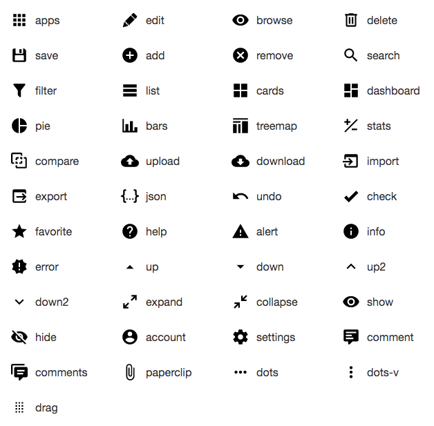
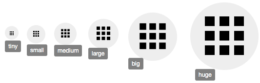

# React-CRUD-Icons &middot; [](https://github.com/evoluteur/react-crud-icons/blob/master/LICENSE) [](https://www.npmjs.com/package/react-crud-icons) 


React-CRUD-Icons is a set of SVG icons for CRUD (Create, Read, Update, Delete) apps, implemented as a React component with [light & dark themes](#themes) and tooltip.


### 45 SVG Icons

A set of icons for CRUD applications... hand-picked among thousands at [Material Design Icons](https://materialdesignicons.com/).



Names: account, add, alert, apps, bars, browse, cards, check, collapse, comment, comments, compare, dashboard, delete, dots, dots-v, down, down2, download, drag, edit, error, expand, export, favorite, filter, help, hide, import, info, json, list, paperclip, pie, remove, save, search, settings, show, stats, treemap, undo, up, up2, upload.

<a name="themes"></a>
### 2 Themes

Themes: light, dark.


To disable the icon hover effect, set theme = "none".


### 6 Sizes

Sizes: tiny, small, medium, large, big, huge.




## Installation

The package can be installed via [npm](https://www.npmjs.com/package/react-crud-icons):

```
npm install react-crud-icons --save
```

You’ll need to install React and PropTypes separately since those dependencies aren't included in the package. 

Below is a simple example of how to use the component in a React view. You will also need to include the CSS file from this package (or provide your own). The example below shows how to include the CSS from this package if your build system supports requiring CSS files (Webpack is one that does).

```js
import React from "react";
import Icon from "react-crud-icons";

import "../node_modules/react-crud-icons/dist/react-crud-icons.css";

class Example extends React.Component {
  render() {
    return (
      <Icon
        name = "edit"
        tooltip = "Edit"
        theme = "light"
        size = "medium"
        onClick = { doSomething }
      />
    );
  }
}
```


## License

Copyright (c) 2019 [Olivier Giulieri](https://evoluteur.github.io/).

react-crud-icons is released under the [MIT license](http://github.com/evoluteur/react-crud-icons/blob/master/LICENSE).

To suggest a feature or report a bug: [https://github.com/evoluteur/react-crud-icons/issues](https://github.com/evoluteur/react-crud-icons/issues)
 