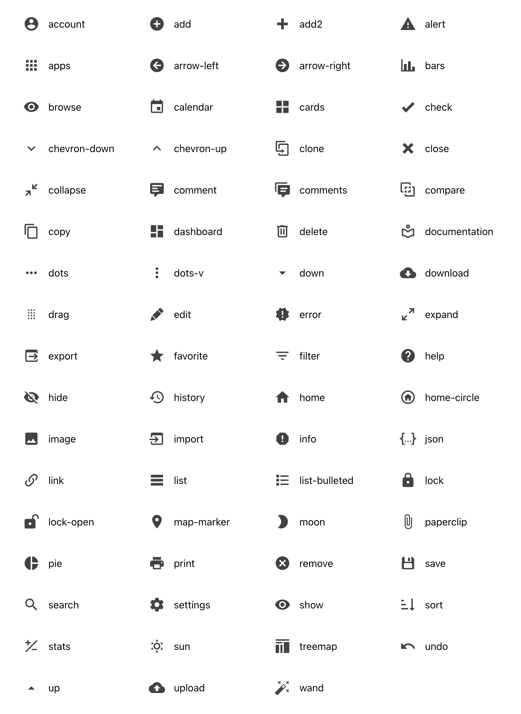

# React-CRUD-Icons · [](https://github.com/evoluteur/react-crud-icons/blob/main/LICENSE) [](https://www.npmjs.com/package/react-crud-icons)

**React-CRUD-Icons** is a set of SVG icons for CRUD (Create, Read, Update, Delete) apps, implemented as a React component with light & dark themes and tooltip.

Check out [React-CRUD-Icons live demo](https://evoluteur.github.io/react-crud-icons/).

### 67 SVG Icons

A set of icons for CRUD applications... hand-picked among thousands at [Material Design Icons](https://materialdesignicons.com/).



<a name="themes"></a>

### 2 Themes

Themes: light, dark.


To disable the icon hover effect, set theme = "none". It will only render the SVG without CSS classes.

### 6 Sizes

Sizes: tiny, small, medium, large, big, huge.


## Installation

The package can be installed via [npm](https://www.npmjs.com/package/react-crud-icons):

```
npm install react-crud-icons --save
```

You’ll need to install React and PropTypes separately since those dependencies aren't included in the package.

To rebuild the project:

```
npm install
npm run build
```

## Usage

Below is a simple example of how to use the component in a React view. You will also need to include the CSS file from this package (or provide your own). The example below shows how to include the CSS from this package if your build system supports requiring CSS files (Webpack is one that does).

```js
import React from "react";
import Icon from "react-crud-icons";

import "react-crud-icons/dist/react-crud-icons.css";

const ExampleComponent = () => (
  <Icon
    name="edit"
    tooltip="Edit"
    theme="light"
    size="medium"
    onClick={doSomething}
  />
);
```

Notes:

- Icons only take focus on tab when the "onClick" property is set and they are not disabled.
- The component uses inline SVG for faster display.

## Properties

| Prop      | Description              |
|-----------|--------------------------|
| name      | Possible values: "account", "add", "add2", "alert", "apps", "arrow-left", "arrow-right", "bars", "browse", "calendar", "cards", "check", "chevron-down", "chevron-up", "clone", "close", "collapse", "comment", "comments", "compare", "copy", "dashboard", "delete", "documentation", "dots", "dots-v", "down", "download", "drag", "edit", "error", "expand", "export", "favorite", "filter", "help", "hide", "history", "home", "home-circle", "image", "import", "info", "json", "link", "list", "list-bulleted", "lock", "lock-open", "map-marker", "moon", "paperclip", "pie", "print", "remove", "save", "search", "settings", "show", "sort", "stats", "sun", "treemap", "undo", "up", "upload", "wand". |
| size      | Possible values: "tiny", "small", "medium", "large", "big", "huge". |
| theme     | Possible values: "light", "dark". Use theme="none" to display raw SVG without the CSS classes and hover effect.|
| tooltip   | Tooltip text shown on hover. |
| disabled  | Disable click event (icon in grey). |
| onClick   | Callback function triggered when icon is clicked. If empty, there will be no hover effect on the icon. |
| className | Additional CSS class name. |


## License

Copyright (c) 2023 [Olivier Giulieri](https://evoluteur.github.io/).

React-CRUD-Icons is Open Source wih [MIT license](http://github.com/evoluteur/react-crud-icons/blob/master/LICENSE).

To suggest a feature or report a bug: [https://github.com/evoluteur/react-crud-icons/issues](https://github.com/evoluteur/react-crud-icons/issues)

Notes: React-CRUD-Icons was originaly made for [Evolutility-UI-React](https://github.com/evoluteur/evolutility-ui-react).
